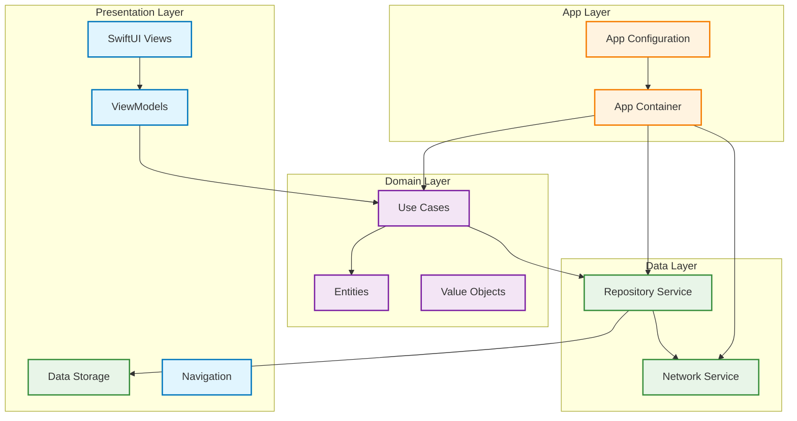
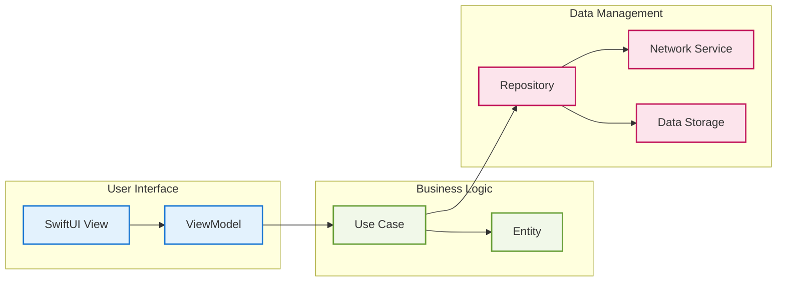
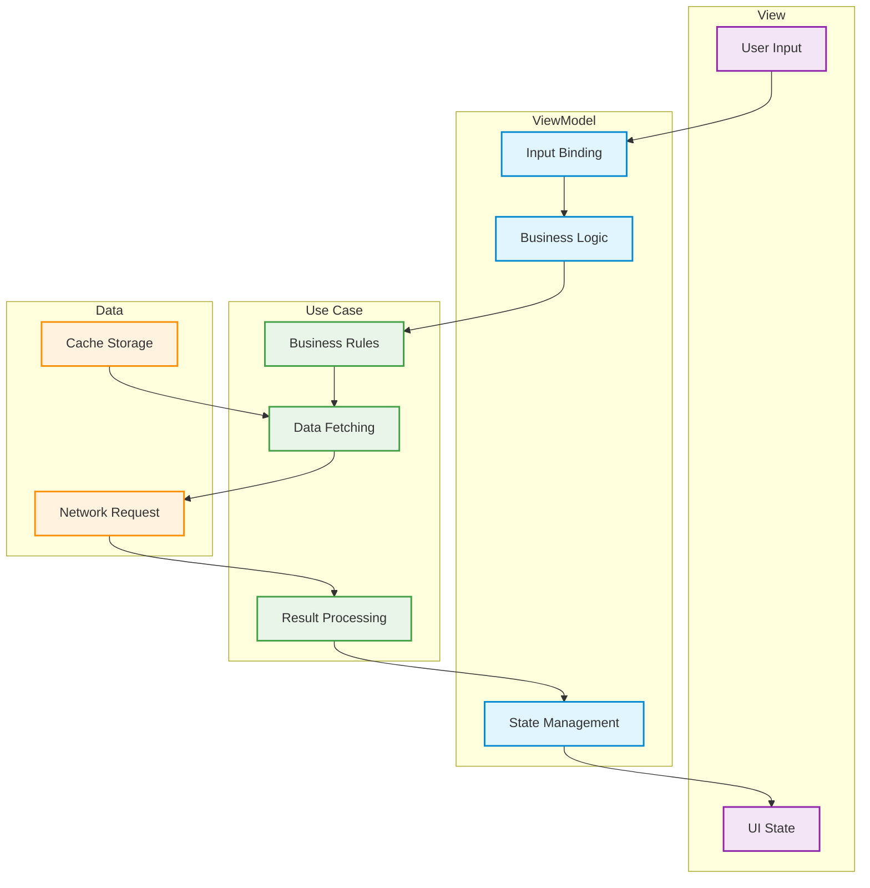
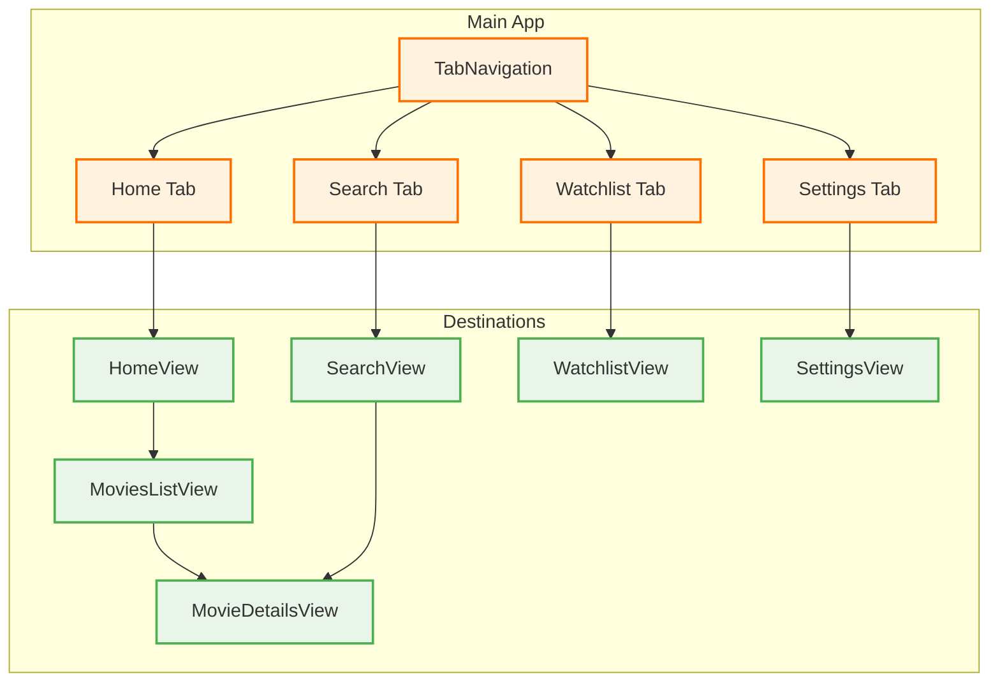

# System Architecture

## Overview
Trending Movies Today follows Clean Architecture principles with MVVM pattern using SwiftUI. The architecture maintains strict separation of concerns between business logic, data management, and user interface.

## Architecture Layers



## Data Flow Architecture



## Layer Responsibilities

### Domain Layer
**Purpose**: Pure business logic and entities
**Key Components**:
- **Entities**: `Movie`, `MovieFilters`, `MovieQuery`
- **Use Cases**: `SearchMoviesUseCase`, `TrendingMoviesUseCase`, etc.
- **Value Objects**: `SearchMoviesUseCaseRequestValue`
- **Protocols**: `UseCaseProtocol`, `MovieQuery`

### Data Layer
**Purpose**: Data management and persistence
**Key Components**:
- **Network Service**: `TMDBNetworkService` (Moya-based)
- **Repository Services**: Direct service implementations (temporary)
- **Data Storage**: `MovieStorage` (UserDefaults-based)
- **Response Models**: `TMDBResponseModels` with domain mapping

### Presentation Layer
**Purpose**: User interface and user interactions
**Key Components**:
- **Views**: SwiftUI view components (`MoviesListView`, `MovieDetailsView`, etc.)
- **ViewModels**: `ObservableMoviesListViewModel`, `ObservableMovieDetailsViewModel`
- **Components**: Reusable UI components (`MovieCard`, `SearchBar`, etc.)
- **Navigation**: `TabNavigation` and `AppDestination` routing

### Dependency Injection Layer
**Purpose**: Centralized dependency management
**Key Components**:
- **AppContainer**: Shared container with all registrations
- **PresentationContainer**: Extension for SwiftUI ViewModels

## Dependency Injection Architecture

### Container Structure

```mermaid
graph TB
    subgraph "AppContainer (SharedContainer)"
        AC1[appConfiguration - singleton]
        AC2[tmdbNetworkService - singleton]
        AC3[posterImagesRepository - singleton]
        AC4[searchMoviesUseCase - fresh]
        AC5[trendingMoviesUseCase - fresh]
        AC6[popularMoviesUseCase - fresh]
        AC7[nowPlayingMoviesUseCase - fresh]
        AC8[topRatedMoviesUseCase - fresh]
        AC9[upcomingMoviesUseCase - fresh]
        AC10[fetchDetailsMovieUseCase - fresh]
        AC11[discoverMoviesUseCase - fresh]
    end
    
    subgraph "PresentationContainer (AppContainer Extension)"
        PC1[observableMoviesListViewModel - factory]
        PC2[observableMovieDetailsViewModel - @MainActor factory]
        PC3[searchViewModel - factory]
    end
    
    AC1 --> AC2
    AC1 --> AC3
    AC1 --> AC4
    AC1 --> AC5
    AC1 --> AC6
    AC1 --> AC7
    AC1 --> AC8
    AC1 --> AC9
    AC1 --> AC10
    AC1 --> AC11
    
    PC1 --> AC4
    PC2 --> AC10
    PC3 --> AC4
    
    classDef container fill:#e8f5e8,stroke:#4caf50,stroke-width:2px
    
    class AC1,AC2,AC3,AC4,AC5,AC6,AC7,AC8,AC9,AC10,AC11,PC1,PC2,PC3 container
```


### Registration Rules
1. **Singletons**: Network services, repositories, configuration
2. **Fresh Instances**: Use cases (business logic should be fresh per call)
3. **Factory Methods**: ViewModels with proper lifecycle management

## Network Architecture

### API Integration Flow
```mermaid
graph LR
    A[Use Case] --> B[Network Service]
    B --> C[Moya Target]
    C --> D[URLSession]
    D --> E[API Response]
    E --> F[Response Model]
    F --> G[toDomain()]
    G --> H[Domain Entity]
    H --> I[Use Case Response]
    
    classDef domain fill:#fff3e0,stroke:#ff6f00,stroke-width:2px
    classDef network fill:#e8eaf6,stroke:#3f51b5,stroke-width:2px
    classDef data fill:#e0f2f1,stroke:#009688,stroke-width:2px
    
    class A,H,I domain
    class B,C,D,E network
    class F,G data
```

### Request/Response Pattern
```swift
// Use Case Protocol
protocol UseCaseProtocol {
    func execute(request: RequestType, 
                 cached: @escaping (ResponseType) -> Void,
                 completion: @escaping (Result<ResponseType, Error>) -> Void) -> Cancellable?
}

// Implementation Pattern
func execute(request: MoviesRequest,
            cached: @escaping (MoviesPage) -> Void,
            completion: @escaping (Result<MoviesPage, Error>) -> Void) -> Cancellable?
```

## State Management Architecture

### MVVM State Flow


### State Management Best Practices
1. **Single Source of Truth**: ViewModels hold application state
2. **Unidirectional Flow**: State flows from ViewModel to View only
3. **Reactive Updates**: Use `@Published` properties for automatic UI updates
4. **Main Actor**: Ensure UI updates happen on main thread

## Persistence Architecture

### Storage Flow

```mermaid
graph LR
    A[View] --> B[ViewModel]
    B --> C[Use Case]
    C --> D[Repository]
    D --> E[MovieStorage]
    E --> F[UserDefaults]
    F --> G[JSON/Codable]
    G --> H[StoredMovie]
    
    classDef ui fill:#fce4ec,stroke:#e91e63,stroke-width:2px
    classDef business fill:#f1f8e9,stroke:#7cb342,stroke-width:2px
    classDef storage fill:#e1f5fe,stroke:#0288d1,stroke-width:2px
    
    class A,B ui
    class C business
    class D,E,F,G,H storage
```


### Data Storage Strategy
- **Watchlist/Favorites**: UserDefaults with Codable encoding
- **Cache**: In-memory cache for search results
- **Persistence**: No heavy database (CoreData/SwiftData) - designed for simplicity

## Navigation Architecture

### Tab-Based Navigation


### Navigation Flow
1. **Tab Navigation**: Bottom tab bar for main sections
2. **Deep Linking**: `AppDestination` enum for programmatic navigation
3. **Coordinator Pattern**: Navigation state management

## Critical Architecture Considerations

### Known Issues
1. **Two Domain/Data Layers**: Active in-app implementation vs. dormant SPM packages
2. **Missing Repository Abstraction**: Current implementation bypasses repository pattern
3. **Hardcoded API Key**: Security risk in current implementation
4. **Callback Pattern**: Use cases use callbacks instead of modern async/await

### Best Practices
1. **Layer Independence**: Each layer should be independent and testable
2. **Dependency Inversion**: Higher layers should depend on abstractions
3. **Single Responsibility**: Each component should have one clear purpose
4. **Testability**: All components should be easily testable in isolation

### Future Improvements
1. **Repository Pattern**: Implement proper repository abstraction layer
2. **Async/Await**: Migrate use cases to modern async/await pattern
3. **SwiftData**: Consider CoreData/SwiftData for complex data relationships
4. **Testing**: Expand test coverage with integration tests