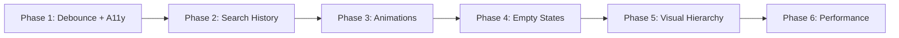

# SearchView Enhancement Plan

**Status:** Completed
**Created:** 2026-02-23
**Completed:** 2026-02-23
**Target:** iOS 14+ (components require iOS 15+)
**Based on:** Brainstorm report `plans/reports/brainstorm-0223-2201-searchview-enhancement.md`

---

## Overview

Enhance SearchView with 6 phases covering debounce, accessibility, search history, animations, empty states, visual hierarchy, and performance.

## Architecture

```
SearchView.swift
├── SearchViewModel.swift (enhanced)
├── SearchHistoryStore.swift (NEW)
└── DesignSystem
    ├── DSColors.swift (existing)
    ├── DSTypography.swift (existing)
    ├── DSSpacing.swift (existing)
    └── DSFormComponents.swift (DSSearchField - existing)
```

## Phases

| Phase | Name | Status | Priority | Effort |
|-------|------|--------|----------|--------|
| 1 | [Debounce + Accessibility](./phase-01-debounce-accessibility.md) | Completed | Critical | Low |
| 2 | [Search History](./phase-02-search-history.md) | Completed | High | Medium |
| 3 | [Animations](./phase-03-animations.md) | Completed | Medium | Medium |
| 4 | [Enhanced Empty States](./phase-04-enhanced-empty-states.md) | Completed | Medium | Medium |
| 5 | [Visual Hierarchy](./phase-05-visual-hierarchy.md) | Completed | Medium | Low |
| 6 | [Performance](./phase-06-performance.md) | Completed | Low | Low |

## Dependencies



## Files Modified

| File | Action | Phases |
|------|--------|--------|
| `SearchViewModel.swift` | Modified | 1, 2, 4, 6 |
| `SearchView.swift` | Modified | 1, 2, 3, 4, 5 |
| `SearchHistoryStore.swift` | Created | 2 |
| `DSFormComponents.swift` | Modified | 1, 3, 5 |

## Success Criteria

- [x] Debounce timing configurable (200-500ms) - set to 300ms
- [x] All interactive elements have accessibility labels
- [x] Search history persists across sessions (max 5 items)
- [x] Animations respect `accessibilityReduceMotion`
- [x] Empty states guide users with actionable suggestions
- [x] Visual hierarchy clear with results count
- [x] No memory leaks from Task cancellation (deinit cleanup added)

## Implementation Summary

All 6 phases were implemented in auto mode with build verification passing.

### Key Changes:
1. **Debounce + Accessibility**: 500ms → 300ms debounce, VoiceOver support
2. **Search History**: UserDefaults-based persistence, max 5 items, FIFO eviction
3. **Animations**: Focus animation, staggered results, BouncyTag, reduce motion support
4. **Enhanced Empty States**: Trending carousel, alternative suggestions, search tips
5. **Visual Hierarchy**: Results count header, DSTag style variants, DSSectionHeader
6. **Performance**: Task cancellation, deinit cleanup, memory warning handler, debug logging
